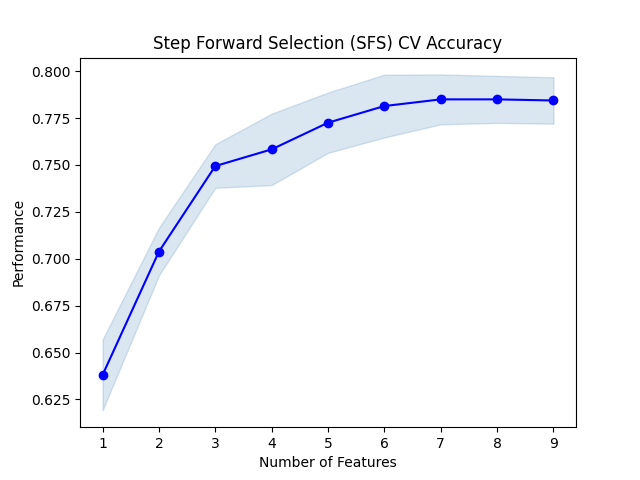
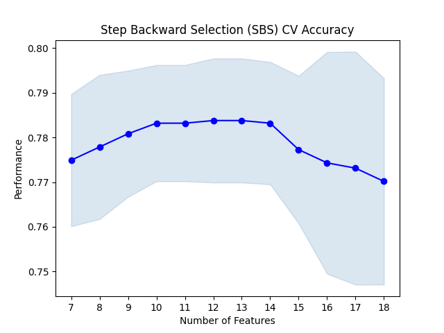

<div align="center">

<br>

# Obesity Feature Selection
[](LICENSE)
[](https://www.python.org/)
[](https://archive.ics.uci.edu/dataset/544/estimation+of+obesity+levels+based+on+eating+habits+and+physical+condition)
[](https://www.codecademy.com/)
[](https://github.com/rosspeili)

<br>

</div>

## Overview

**Obesity Feature Selection** is a performance-driven classification and feature selection system designed to analyze and predict whether individuals are obese based on their physiological and behavioral habits. Built around the UCI Machine Learning Obesity dataset, it trains a Logistic Regression model and subsequently optimizes its feature space using advanced wrapper selection methodologies.

This repository represents a polished, production-ready solution for the **Codecademy Wrapper Methods project challenge**. Rather than simply executing a static script, this repository transforms the requirements into a beautifully robust, modular pipeline while fulfilling every step of the original challenge. It is 100% free for all to use, study, and modify.

> [!TIP]
> **Deep Dive**: The system implements an 80/20 train/test split to prevent data leakage. It dynamically handles dataset standardization via Scikit-Learn pipelines and automatically implements Cross-Validated Sequential Forward Selection (SFS), Sequential Backward Floating Selection (SBS), and Recursive Feature Elimination (RFE) to guarantee optimal and un-biased analytical comparisons.

## Challenge Coverage

This pipeline satisfies all Codecademy project tasks natively within its execution flow:
1. **Data Prep**: Integrates `pandas` preprocessing, dropping direct target correlates (Height/Weight), mapping categoricals to numerics, and one-hot encoding transit variables.
2. **Base Evaluation**: Fits a comprehensive Logistic Regression model utilizing **GridSearchCV** over a 5-Fold Stratified subset to optimize Regularization strength (`C`).
3. **Sequential Forward Selection**: Configures forward inclusion via 5-Fold CV to isolate the top 9 predictive features and plots accuracy tracking.
4. **Sequential Backward Selection**: Configures backward elimination via 5-Fold CV to isolate the top 7 core features and plots accuracy tracking.
5. **Recursive Elimination**: Standardizes data arrays safely within a Scikit-Learn Pipeline and systematically ranks coefficients to eliminate features iteratively until the optimally scaled 8 remain.

### Feature Selection Accuracy Plots
<div align="center">
  
  
</div>
<br>

## Key Features

- **Interactive Tactical Console**: Launch `main.py` directly to process a fully immersive, styled terminal sequence mapping dynamically to the feature selection evaluations.
- **Automated Preprocessing**: Ingests the raw dataset and structurally processes all independent components robustly within `data_loader.py` before they hit the models.
- **Automated Reporting**: Generates instant performance metrics comparing subset accuracies via formatted rich tables and interactive matplotlib plotting saved asynchronously to `results/`.
- **Modular Architecture**: Clean separation between data handlers, distinct model algorithms, and visualization utilities following standard engineering patterns.

## Model Performance

The execution script runs exploratory details followed by all primary feature selection demonstrations.

| Target Config | Features Kept | Evaluation Metric | Focus Area |
| :--- | :--- | :--- | :--- |
| **Base Model** | **18** | **Test Accuracy** | Full dataset dimensionality baseline |
| **SFS** | **9** | **Test Accuracy (CV)** | Iterative bottom-up addition |
| **SBS** | **7** | **Test Accuracy (CV)** | Iterative top-down elimination |
| **RFE** | **8** | **Test Accuracy** | Scaled coefficient recursive dropping |

> [!IMPORTANT]
> **Performance Note**: The accuracy subsets will demonstrate that through proper selection (SFS/SBS/RFE), complex models can discard significant dimensional noise while maintaining or occasionally drastically improving their classification boundaries against the complete 18-feature baseline.

## Project Structure

```bash
Obesity/
├── src/                # Core Logic
│   ├── data_loader.py  # Ingestion, Mapping & Cleaning
│   ├── visualization.py# Accuracies & Selection Visualizations
│   └── models/         # Model and Selection Definitions
│       ├── logistic_regression.py
│       ├── sfs.py
│       ├── sbs.py
│       └── rfe.py
├── tests/              # Unit Validation Tests
│   └── test_data_loader.py
├── results/            # Automated extraction of .png line graphs
├── main.py             # Master Interactive Terminal App
├── requirements.txt    # Dedicated Environment dependencies
├── LICENSE             # MIT License
└── README.md           # System Documentation
```

## Quick Start

### 1. Installation

```bash
# Clone the repository
git clone https://github.com/rosspeili/obesity-wrapper-methods.git
cd obesity-wrapper-methods

# Setup Environment
python -m venv .venv
source .venv/bin/activate  # Windows: .venv\Scripts\activate

# Install Dependencies automatically
pip install -r requirements.txt
```

### 2. Usage

**Boot the Tactical Console**
```bash
python main.py
```
*Note: This will sequentially trigger the feature extraction processes and output formatted tables representing the selection differentials.*

**Advanced MLOps Execution**
The CLI comes with production-ready flags for ML Engineers:

```bash
# Display detailed Classification Reports and Confusion Matrices
python main.py --verbose

# Serialize and save all evaluated models to disk
python main.py --save 

# Run a custom dataset path
python main.py --data-path /custom/path/to/data.csv
```

**Run System Tests**
```bash
pytest tests/
```

> The testing pipeline features comprehensive unit validation of internal preprocessing mapping components, assuring data frame boundaries are preserved correctly.

## License

This project is licensed under the MIT License - see the [LICENSE](LICENSE) file for details.

<br>
<div align="center">
  <sub>Developed and Maintained by <b>rosspeili</b></sub>
  <br>
  <sub>Free and Open Source (MIT)</sub>
</div>
